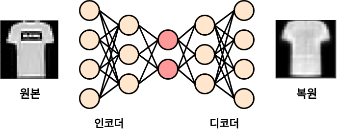

# 사람의 지도 없이 학습하는 Autoencoder

레이블이 없는 상태서 특징추출을 하는 오토인코더에 대해 배워봅니다.

  * [개념] 오토인코더 기초
  * [프로젝트 1] 오토인코더로 이미지의 특징을 추출하기
  * [프로젝트 2] 오토인코더로 망가진 이미지 복원하기
  * 더 보기

## 오토인코더 기초

지금까지는 입력값에 정답이 포함된 지도학습을 위주로 공부했습니다.
반대로 이 챕터에서는 입력값(X)만이 주어진채로 비지도학습을 하는 방법인
오토인코더(Autoencoder)에 대해 알아보겠습니다.

이미지, 오디오, 텍스트 등 데이터 형태와 관계 없이 사람이 직접 정답을 알려주는 경우는
사람이던 컴퓨터던 매우 효율적으로 학습할 수 있습니다.
바로 입력과 출력의 관계만 설명할 수 있으면 되기 때문입니다.
하지만 데이터셋에 정답이 포함되지 않은 경우엔 이야기가 달라집니다.
외국어를 배울때 원어민이 옆에서 과외를 해줄때는 배울만 하지만,
한 글자도 모르는 상태에서 외국어로 된 책을 통해 배우라고
하는 것은 어려운것과 비슷한 느낌입니다.

그럼에도 불구하고 주어진 데이터만으로 패턴을 찾는 비지도학습은
흥미로운 주제입니다. 세상에 존재하고 계속 만들어지고 있는 대부분의
데이터는 정답이 없기 때문입니다.
인공지능이 실생활과 서비스에서 진정한 확장성을 가지려면
비지도학습과 준지도학습의 발전이 따라야 한다고 생각합니다.

지도학습은 단순히 말해 입력 x와 정답 y사이를 잇는 관계를 찾는 것 입니다.
정답이 있으면 현재 예측값이 얼마나 틀렸는지도 명확하고
오차를 측정할 수 있기 때문에 오류값(Loss)을 구하기도 쉽습니다.

지도학습의 이 아이디어를 빌려 x를 받아 x를 출력하도록 설계된
신경망이 바로 오토인코더 입니다.
단, 신경망은 범용근사자(Universal Function Approximator)로서
근사치를 출력하기 때문에 입력된 x를 복원한다는 개념이 더 알맞습니다.
그러므로 오류값도 x를 얼마나 복원했는지를 뜻하는
복원오차, 혹은 정보손실값(Reconstruction Loss)이라는 용어를 사용합니다.

오토인코더의 또 다른 중요한 특징은 입력과 출력의 크기는 같지만
중간으로 갈수록 신경망의 차원이 줄어든다는겁니다.
이런 특이한 구조로 인하여 정보의 통로가 줄어들고
병목현상이 일어나 입력의 특징들이 '압축'이 되도록 학습됩니다.
작은차원에 고인 압축된 표현을 우리말로
"잠재변수"(Latent Vector)라고하고,
간단하게 줄여 `z`라고도 부릅니다.

또, Latent Vector의 앞뒤를 구분하여
앞부분을 인코더(Encoder),
뒷부분을 디코더(Decoder)라고 합니다.
인코더는 정보를 받아 압축을 하고,
디코더는 압축된 표현을 풀어 다시 입력을
복원시키는 역할을 하여 붙여진 이름입니다.

실제로 훈련시켜 보면 오토인코더로 입력이 다시 복원이 되는것이 신기하긴
하지만 단순히 입력을 복제하는 것이 핵심은 아닙니다. 
진짜로 흥미로운 부분은 압축된 데이터입니다.
앞서 말했듯 신경망이 받은 이미지를 복원하도록 학습하고 나면
중간층에 이미지의 정보를 낮은 차원에 저장하게 됩니다.
낮은차원에 높은 밀도로 표현되는 데이터이므로 '의미의 압축'이 일어납니다.
이것은 흔히 우리가 알고있는 `zip`압축 같은 것이 아닙니다.
단순히 데이터의 크기를 줄이고 싶을 경우
기존 압축 알고리즘을 사용하는것이 빠르고 안전하나,
오토인코더는 복잡한 데이터의 의미를 담을 수 있다는 점에서 특별합니다.

정보의 압축이 가능하단 것은 결국
정보의 구성에 우선순위가 존재한다는 뜻입니다.
그리고 압축이란 정보에서 덜 중요한 요소를
버리는 과정이라고 정의할 수 있습니다.
그러므로 오토인코더에서는 필연적으로 정보의 손실이 일어나게 됩니다.
이것은 정보의 디테일을 잃어버린다는 뜻이 될 수 있으나,
오히려 중요하지 않은 정보를 떼어내고 중요한 정보만 남겨두는
일종의 데이터 가공이라고 볼 수도 있습니다.

이런 특징으로 인해 오토인코더는 주로 복잡한 비선형 데이터의
차원을 줄이는 용도로 쓰이나 산업에서 비정상 거래 검출,
데이터 시각화와 복원, 의미 추출, 이미지 검색등에도 쓰이고 있습니다.
그리고 여러가지의 파생 모델들이
기계번역, 생성모델 등 여러가지 응용 분야들의 기초가 되고 있습니다.
